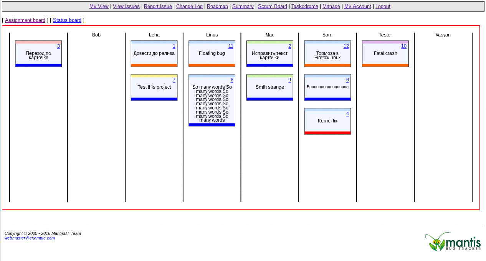
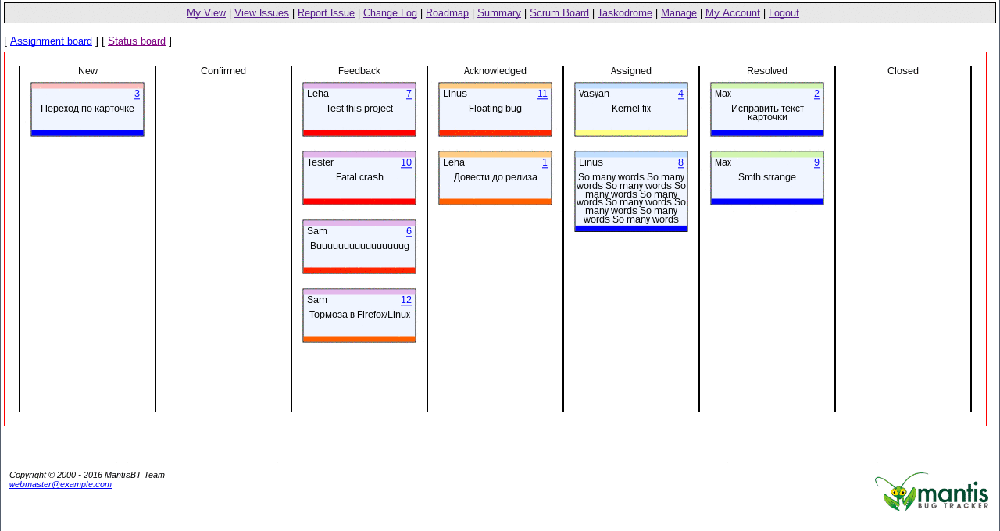
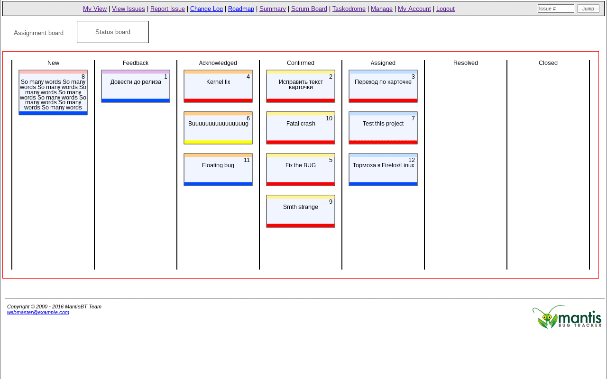

# Taskodrome
Interactive scrum board for Mantis bugtracker 1.2.9 and later.

# Installation
Copy Taskodrome catalogue to mantisbt plugin directory.

If you are upgrading from Taskodrome v.1 to v.2 you should completely remove previous installation of the plugin from your mantisbt plugin directory.

# Dependencies

PHP mbstring extension should be installed.

## Compatibility
MantisBT version | Branch
:---:|---
2.x   | [mantisbt_2.0.0](https://github.com/AuthenticEshkinKot/Taskodrome/tree/mantisbt_2.0.0)
1.3.x | [mantisbt_1.3.0](https://github.com/AuthenticEshkinKot/Taskodrome/tree/mantisbt_1.3.0)
1.2.x | [mantisbt_1.2.9](https://github.com/AuthenticEshkinKot/Taskodrome/tree/mantisbt_1.2.9)

# Features
## Issue drag'n'drop
Changing task's assignee or status has never been so easy! Just drag'n'drop - nothing more.

Assignee:

Status:

## Temperature
Temperature of issue has no analogue in mantisbt. It allows you to simply differ last recently touched issues from forgotten ones. Temperature bar is placed on the bottom of the card.

Designed by svalion https://www.behance.net/svalion
